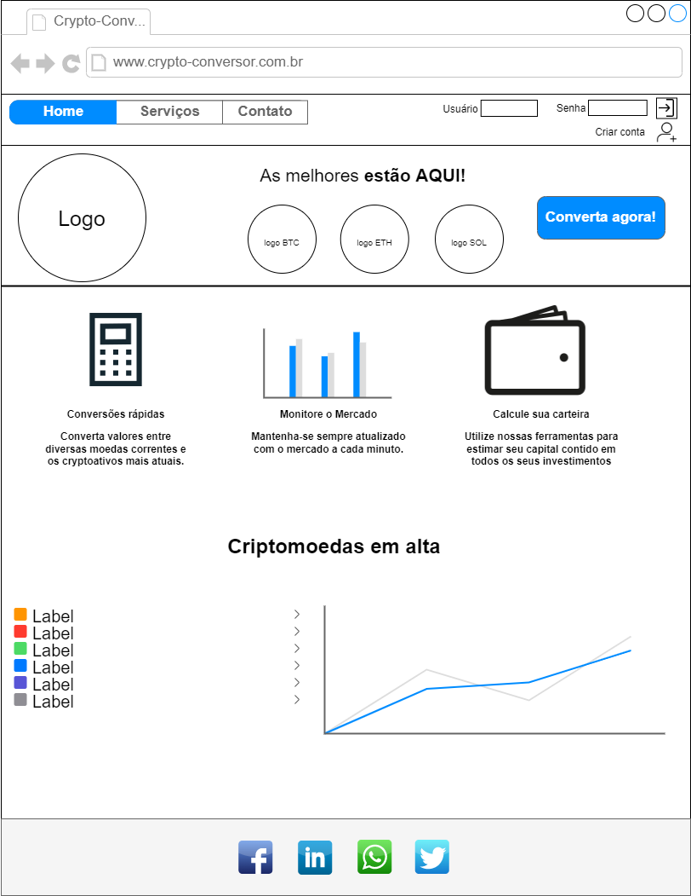
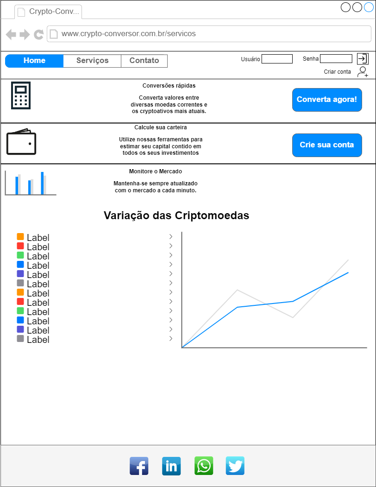
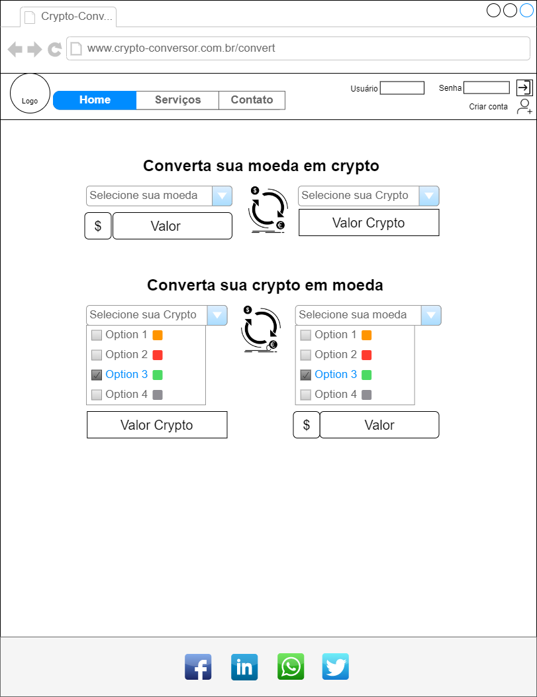
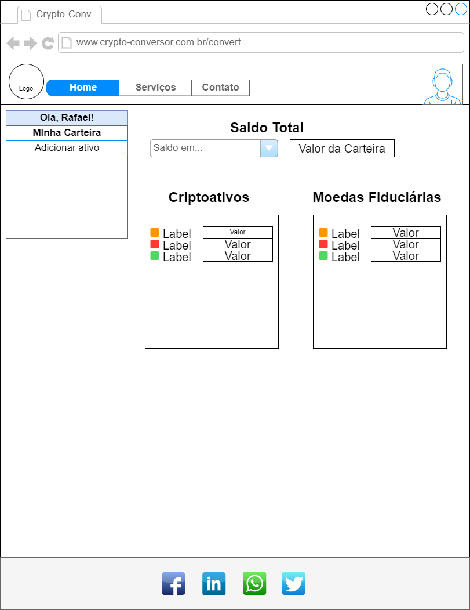
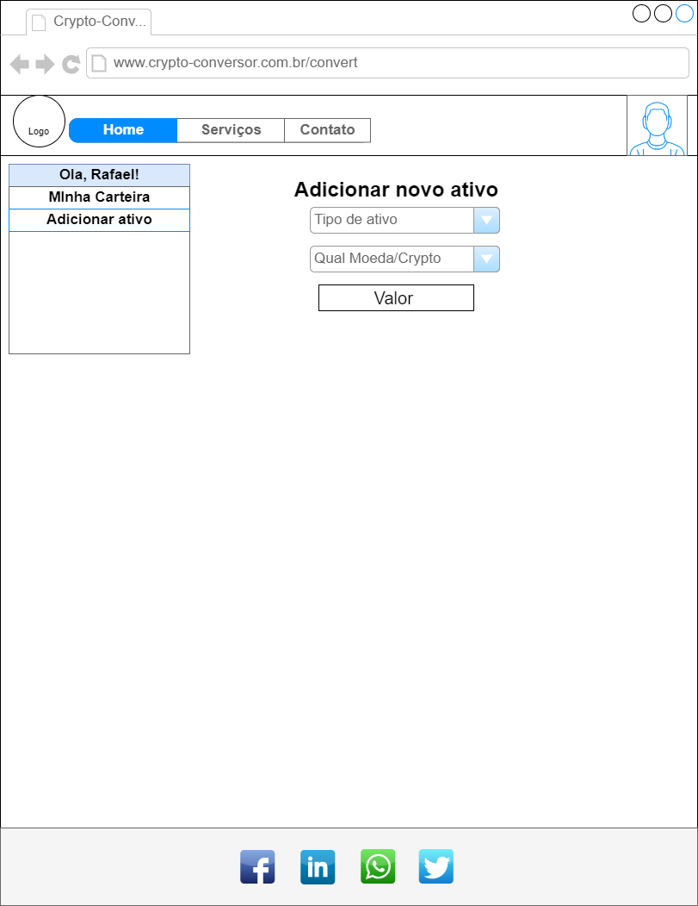
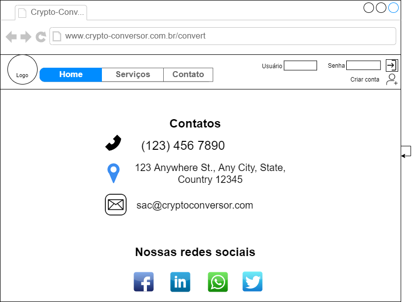

# Projeto de Interface

Link para acesso ao figma do projeto [aqui](https://www.figma.com/file/4KEv3TedF6aTZg7BqXaWUy/Crypto-Conversor?node-id=0%3A1).

Pré-requisitos: <a href="2-Especificação do Projeto.md"> Documentação de Especificação</a>

Visão geral da interação do usuário pelas telas do sistema e protótipo interativo das telas com as funcionalidades que fazem parte do sistema (wireframes).

 Apresente as principais interfaces da plataforma. Discuta como ela foi elaborada de forma a atender os requisitos funcionais, não funcionais e histórias de usuário abordados nas <a href="2-Especificação do Projeto.md"> Documentação de Especificação</a>.

## User Flow

Fluxo de usuário (User Flow) é uma técnica que permite ao desenvolvedor mapear todo fluxo de telas do site ou app. Essa técnica funciona para alinhar os caminhos e as possíveis ações que o usuário pode fazer junto com os membros de sua equipe.

> **Links Úteis**:
> - [User Flow: O Quê É e Como Fazer?](https://medium.com/7bits/fluxo-de-usu%C3%A1rio-user-flow-o-que-%C3%A9-como-fazer-79d965872534)
> - [User Flow vs Site Maps](http://designr.com.br/sitemap-e-user-flow-quais-as-diferencas-e-quando-usar-cada-um/)
> - [Top 25 User Flow Tools & Templates for Smooth](https://www.mockplus.com/blog/post/user-flow-tools)

## Wireframes

# Tela Home-Page
A tela home page apresenta os serviços que podem ser executados através do site e a variação de mercado das principais cryptomoedas no momento, além de ícones para as redes sociais. O bloco apresenta os mesmos elementos fixos: cabeçalho e rodapé.

O cabeçalho da home-page traz quatro elementos distintos:
● Componente de "Serviços", que permite visualizar todos os serviços disponíveis;
● Componente de "Contato", que traz as informações sobre os endereços e números de contato;
● Componente de "login";
● Componente de "Criar conta";

# Tela Serviços
A tela de Serviços contém os serviços que podem ser executados no site, um atalho para a tela de conversão, um atalho para a tela de registro, e a varição financeira das criptomoedas.

# Tela - Converta Agora
A tela "Converta Agora" apresenta as possibilidades de conversão à escolha do usuário. Ao clicar em "Selecione sua Crypto" ou " Selecione sua moeda", será exibida uma lista com os nomes e logotipo das criptomoedas e moedas fiduciárias disponíveis. 

# Tela - Criar conta
Permite ao usuário realizar o seu cadastro.

# Tela - Carteira
Após realizar o login, o usuário é direcionado a uma área onde terá acesso às informações sobre sua carteira de investimentos, onde será possível visualizar separadamente seus ativos, ou o valor total em uma criptomoeda ou moeda fiduciária escolhida. Esta tela será exclusiva para usuários cadastrados, após realizar o login.

# Tela - Adicionar ativo
A tela de Adicionar ativo será onde o usuário poderá acrescentar informações sobre novos investimentos, seja ele em criptomoedas ou moeda fiduciária.

# Tela - Contato
A tela Contato mostra meios de contato do usuário com o site.

