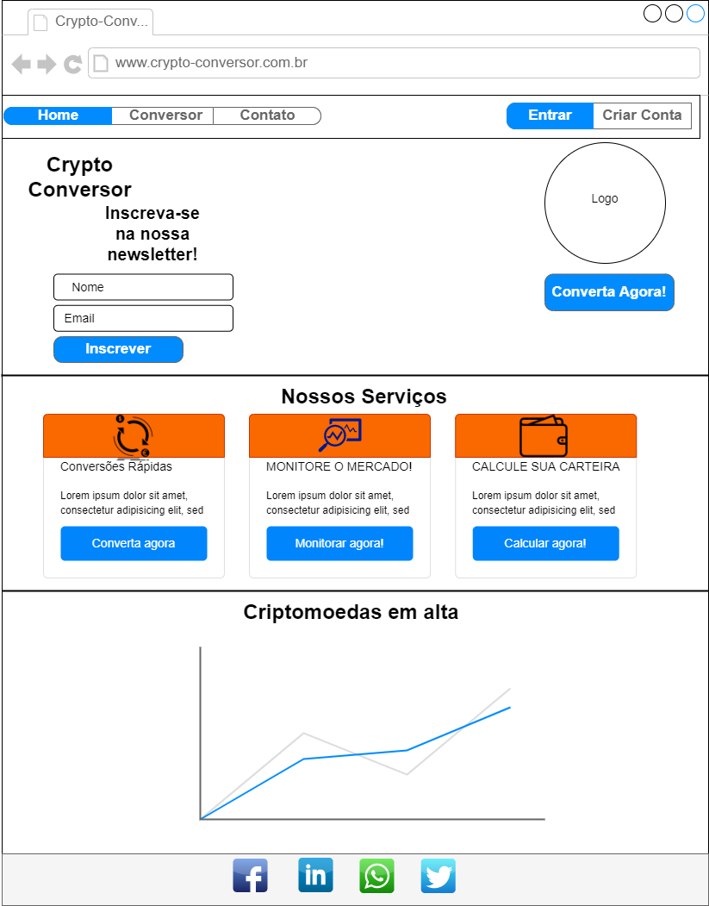
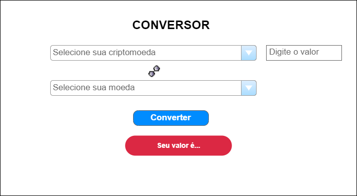
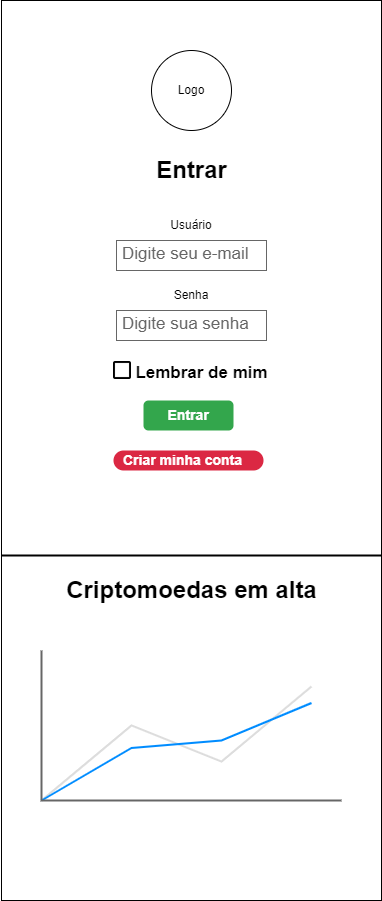
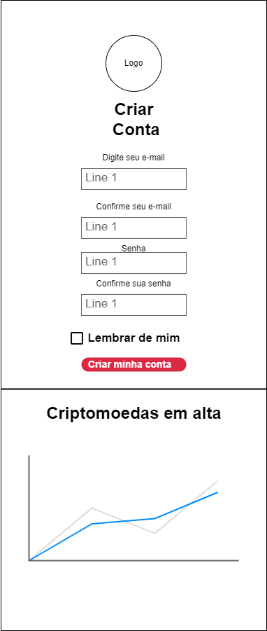
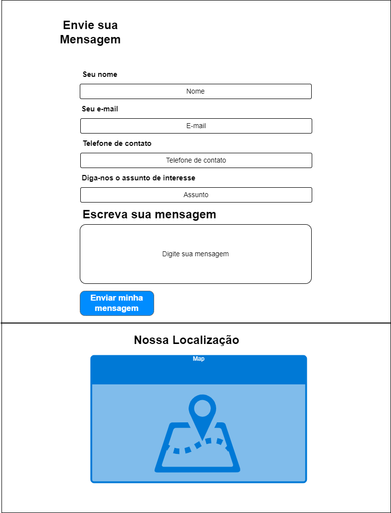
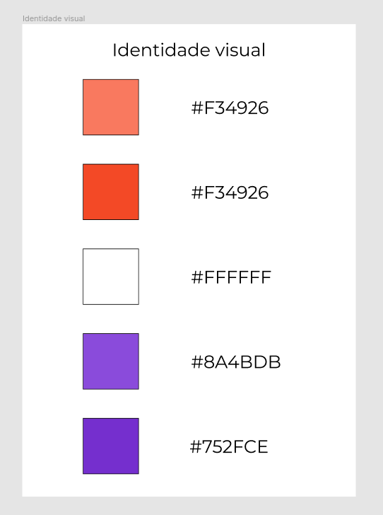
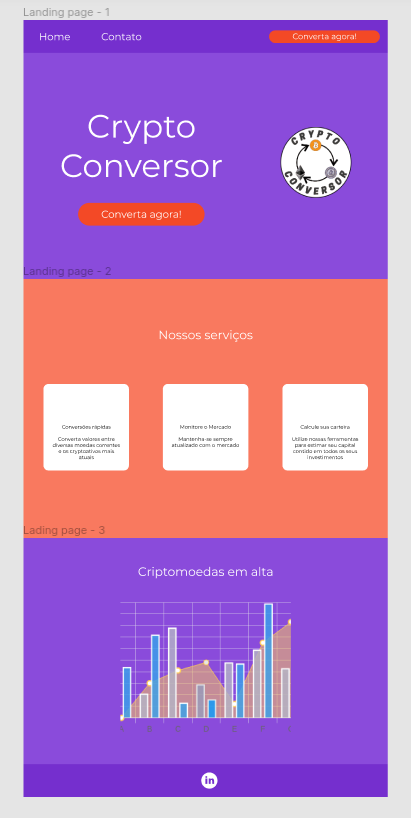
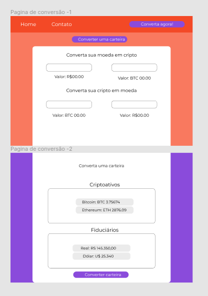
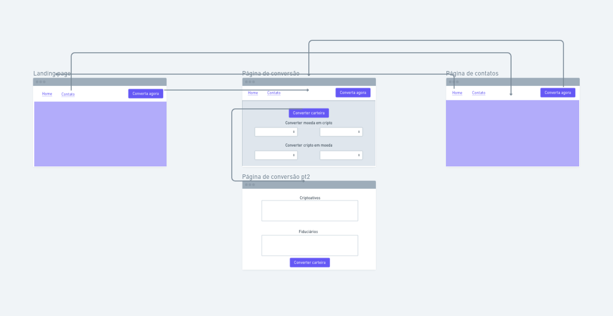

# Projeto de Interface

## Wireframes
### Tela Home-Page
A tela home page apresenta os serviços que podem ser executados através do site e a variação de mercado das principais cryptomoedas no momento, além de ícones para as redes sociais. O bloco apresenta os mesmos elementos fixos: cabeçalho e rodapé.

- Cabeçalho da home-page traz quatro elementos distintos:
- Componente de "Conversor", que permite acesso rápido ao conversor de moedas;
- Componente de "Contato", que traz as informações sobre os endereços e formas de contato;
- Componente de "login";
- Componente de "Criar conta";

### Tela - Converta Agora
A tela "Converta Agora" apresenta as possibilidades de conversão à escolha do usuário. Ao clicar em "Selecione sua Crypto" ou " Selecione sua moeda", será exibida uma lista com os nomes das criptomoedas e moedas fiduciárias disponíveis. 

### Tela - Entrar
Permite ao usuário realizar login no site, validando seus dados cadastrados previamente.

### Tela - Criar conta
Permite ao usuário realizar o seu cadastro.

### Tela - Contato
A tela Contato mostra meios de contato do usuário com o site.

## Protótipo

É possível ver com mais detalhes e interagir com o protótipo clicando 
[aqui.](https://www.figma.com/file/4KEv3TedF6aTZg7BqXaWUy/Crypto-Conversor?node-id=0%3A1) 
Em nosso arquivo de protótipo contamos com as seguintes sessões:
### Identidade visual
A identidade visual constitui atualmente nas diretrizes que serão utilizados na aplicação.
Atualmente conta com a especificação de cores junto de seu código hexadecimal.

### Landing page
A landing page está dividida em três partes, a pagina inicial com a chamada para a conversão direta, a parte de exposição de serviços e um gráfico rápido para análise de cotação de alguma criptomoeda.
Bem como o seu cabeçalho(barra de navegação) e rodapé (copyright e links rápidos).

### Página de conversão
A página de conversão constitui a funcionalidade principal da nossa aplicação, é nela em que todo o valor está agregado ao usuário, onde podemos visualizar e converter as criptomoedas, separada em três métodos de conversão.

## Fluxo de usuários  
É possível ver com mais detalhes e interagir com o fluxo do usuário clicando [aqui.](https://whimsical.com/criptoconverter-9NHppfd56ARZFNezT4zYPP)

O contato inicial do usuário é a interação com a landing page, nela será apresentado a proposta inicial do projeto, bem como o logo, nome da aplicação e informações que forem úteis para a conquista do usuário.

Nela existirão alguns links para a tela de Contato e de Conversão.
Na página de conversão existirão três funcionalidades principais, a de conversão de valores de criptomoedas individuais para fiduciários e a operação inversa.
Logo abaixo será possível converter uma lista de criptomoedas ao mesmo tempo, podendo escolher também uma lista de fiduciários para que a análise dos valores pós conversão entre fiduciários também seja possível.
