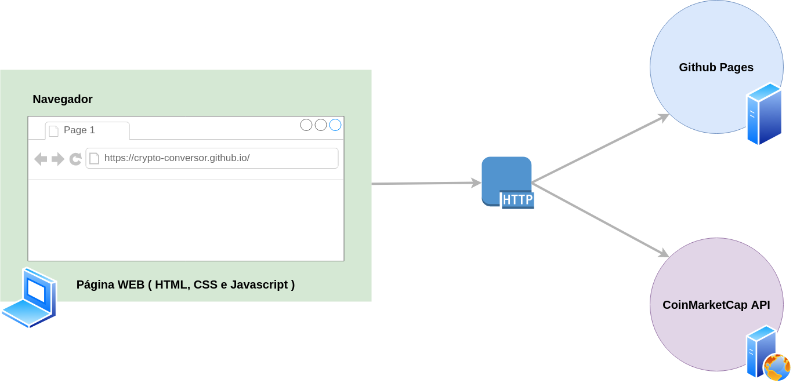

# Arquitetura da Solução
Nesta seção são apresentados os detalhes técnicos da solução criada pela equipe, tratando dos componentes que fazem parte da solução e do ambiente de hospedagem da mesma.
## Diagrama de componentes
Os componentes que fazem parte da solução são apresentados na Figura abaixo.

Figura XX - Arquitetura da Solução

A solução implementada conta com os seguintes módulos:
- **Navegador** — interface básica com sistema (Client)  
- **Páginas Web** — conjunto de arquivos HTML, CSS, JavaScript e imagens que implementam as funcionalidades do sistema.
- **CoinMarketCap API** — plataforma que fornece os dados necessários para o cálculo de cotações no sistema.
- **Github Pages** — serviço de nuvem que permite o acesso às páginas _‘web’_ acessadas através navegador.
Ele será utilizado na hospedagem por ser um serviço do Github que permite hospedagem de arquivos de HTML, CSS e Javascript sem cobrança pela disponibilização de tais serviços, além da facilidade na disponibilização facilitada de **entrega contínua** sem necessidade de configuração adicional.
