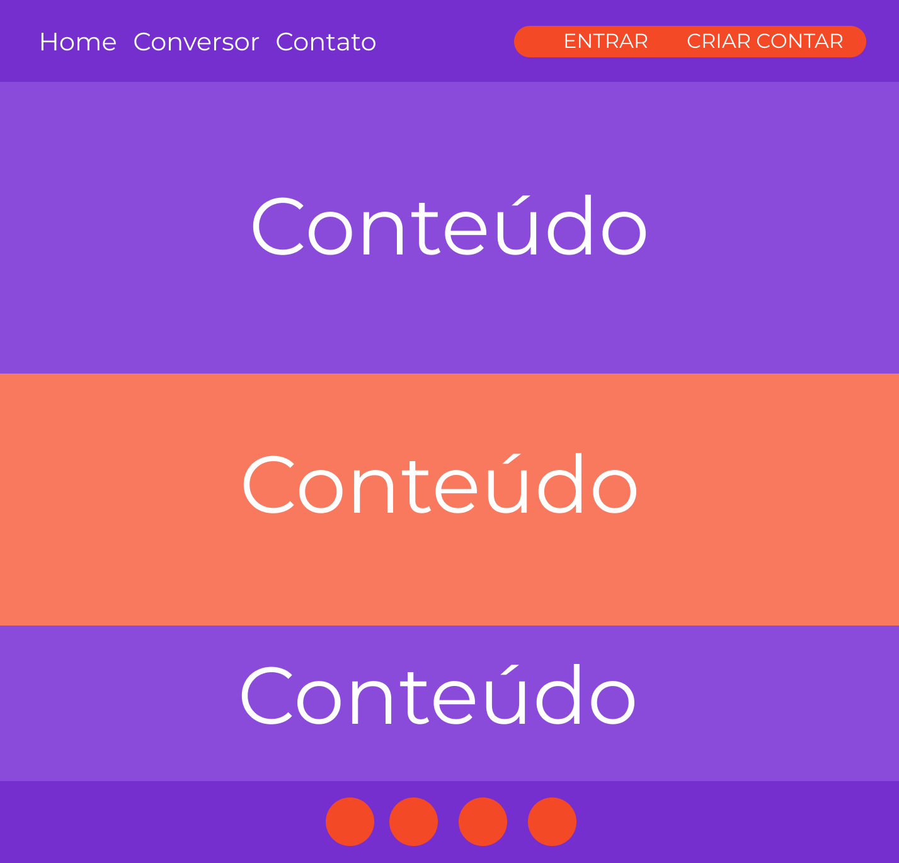

# Template padrão do site

O projeto seguirá o modelo abaixo proposto. A área de conteúdo irá variar de acordo com a necessidade de cada página. Sendo assim, poderão existir 3 áreas com conteúdo ou menos, conforme a necessidade.

O template é composto por:
    * Cabeçalho, contendo dois menus;
    * Divisão 01, divisão 02 e divisão 03, com conteúdo;
    * Rodapé, composto por quatro ícones de redes sociais.

A responsividade será criada com bootstrap.

### Página principal

Tela que contém todas as informações principais do site, links para os principais serviços e cotaçao de criptomoedas.

### Página de conversão

Tela contendo o serviço de conversão de moedas digitais e fiduciárias.

### Página de login

Tela contendo formulário para realizar login no site

### Página de contato

Tela contendo formulário para contato e localização.

