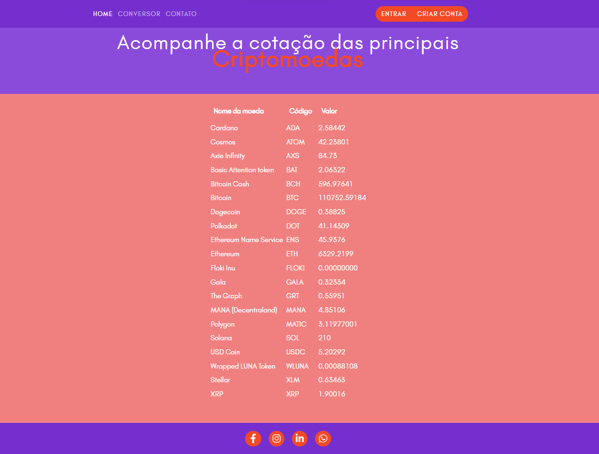

# Funcionalidades do sistema

Nesta seção são apresentadas as telas desenvolvidas para cada uma das funcionalidades do sistema. O respectivo endereço (URL) e outras orientações de acesso são são apresentadas na sequência.

### Landing page

A tela principal do sistema apresenta possibilidade de inscrição, fazer login na página, acessar os serviços e ver a cotação do bitcoin.

__Requisitos atendidos__
* RF-001;
* RF-004;

__Artefatos da funcionalidade__
* index.html;
* style.css;
* normalize.css;
* logo-final.png;
* calculadora.png;
* carteira.png;
* grafico.png.

__Instruções de acesso__

1. Abra um navegador de internet e informe a seguinte URL: https://icei-puc-minas-pmv-ads.github.io/crypto-conversor/
2. A landing page será exibida pelo navegador.

### Conversão entre moedas

Essa tela permite que o usuário faça a conversão entre moedas, sejam elas digitais ou fiduciárias.

__Requisitos atendidos__
* RF-002;

__Artefatos da funcionalidade__
* conversor.html;
* style.css;
* normalize.css;
* conversor.js

__Instruções de acesso__

1. Abra um navegador de internet e informe a seguinte URL: https://icei-puc-minas-pmv-ads.github.io/crypto-conversor/. A landing page será exibida pelo navegador.
2. Clique o botão "Converta agora", na seção "Nossos serviços" ou clique no item "conversor" presente no menu superior da página;
3. Selecione a criptomoeda que deseja converter;
4. Selecione a moeda fiduciária que deseja ver o valor correspondente à criptomoeda;
5. Insira a quantidade de moedas que serão convertidas;
6. Clique no botão "converter valor";

Se deseja fazer a conversão de moeda fiduciária em moeda digital, basta utilizar o botão "inverter".

### Monitoramento do preço de alguns ativos selecionados

Essa tela permite que o usuário veja em tempo real a cotação de algumas criptomoedas selecionadas.

__Requisitos atendidos__
* RF-003;

__Artefatos da funcionalidade__
* monitore_mercado.html;
* style.css;
* normalize.css;
* currency.js

__Instruções de acesso__

1. Abra um navegador de internet e informe a seguinte URL: https://icei-puc-minas-pmv-ads.github.io/crypto-conversor/monitore_mercado.html
2. A página será exibida pelo navegador.
3. Alternativamente pode-se seguir os seguintes passos:
4. Abra um navegador de internet e informe a seguinte URL: https://icei-puc-minas-pmv-ads.github.io/crypto-conversor/. A landing page será exibida pelo navegador.
5. Clique o botão "Monitores agora", na seção "Nossos serviços".

### Dados para contato

Essa tela permite que o usuário envie uma mensagem para a equipe do projeto.

__Requisitos atendidos__
* RF-004;

__Artefatos da funcionalidade__
* contact.html;
* style.css;
* normalize.css;

__Instruções de acesso__

1. Abra um navegador de internet e informe a seguinte URL: https://icei-puc-minas-pmv-ads.github.io/crypto-conversor/. 2. A landing page será exibida pelo navegador.
2. Clique no item "contato" presente no menu superior da página;
3. Preencha os campos disponíveis;
4. Clique no botão "Enviar minha mensagem"

