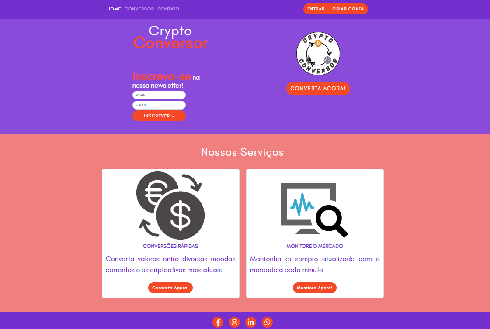

# Funcionalidades do sistema

Nesta seção são apresentadas as telas desenvolvidas para cada uma das funcionalidades do sistema. O respectivo endereço (URL) e outras orientações de acesso são são apresentadas na sequência.

### Landing page

A tela principal do sistema apresenta possibilidade de inscrição, fazer login na página, acessar os serviços e ver a cotação do bitcoin.

__Requisitos atendidos__
* RF-001;
* RF-006;

__Artefatos da funcionalidade__
* index.html;
* style.css;
* normalize.css;
* logo-final.png;
* calculadora.png;
* carteira.png;
* grafico.png.

__Instruções de acesso__

1. Abra um navegador de internet e informe a seguinte URL: https://icei-puc-minas-pmv-ads.github.io/crypto-conversor/
2. A landing page será exibida pelo navegador.